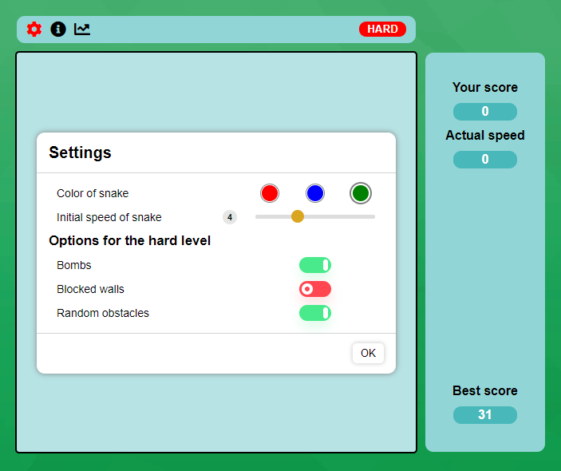
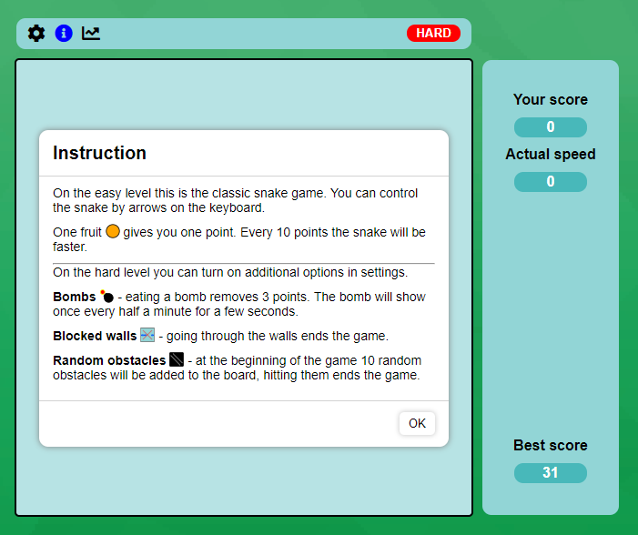
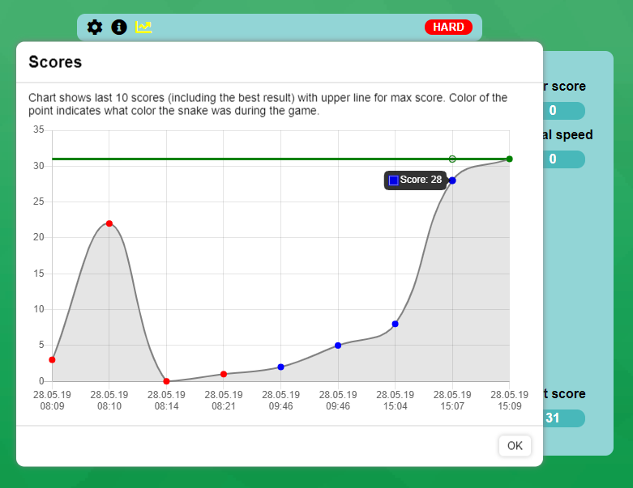

## snakeGame
The Classic snake game available for desktop. Maybe in the future it will also work on mobile phones? ;)

You can control the snake by arrow keys. Hit the Enter key to start/reset the game.
Before starting you can set the initial settings - color and speed of the snake. There are also options that change the game mode (selecting at least one option enables the hard level).

All options are described in the instructions.

Under the last icon in upper menu you can show your scores. The library chart.js is used here.

All options and results are saved in the localStorage in your browser, so you can return to the game at any time.
